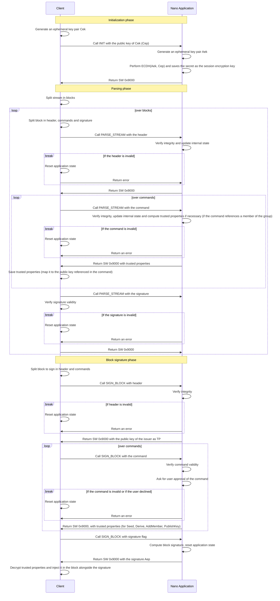

# Signature flow

The flow to sign a block is split in 3 phases:
- **Sign flow initialization:** The application requires the client to provide a public key. The public key received is expected to be an ephemeral key which will only be used during the signature flow. The application generates on his end an ephemeral keypair used to encrypt data (trusted properties). Any error or user rejection will reset the application and erase the ephemeral key pair.
- **Parsing phase:** The client passes previous block of the stream to the application. The application will verify the integrity of the stream during this stage and issue trusted properties related to the members of the trustchain.
- **Signature:** The signature is done by passing to the application the block to sign (the client need to split the block into header and commands). Once the final command is passed to the application and if the user approved every command, the application will release the signature of the block and its ephemeral public key. The client can then inflate the final block by injecting previously returned trusted properties and signature inside the block. 

_Note that the client may perfom some calls to SET_TRUSTED_MEMBER in case a command mentions a member which was not part of the previous call_

# Application trusted properties
The application uses a small TLV to return trusted properties (TPs). Trusted properties are application data which are needed either by the application or the client. A trusted property is encrypted using AES-256-CBC with a secret key generated by an ECDH between the session ephemeral key and the client ephemeral key. The IV used to encrypt the data is always returned first in the response with a type of IV. Trusted properties can't then be decrypted by the client once the user approved the signature of a block. Trusted properties are serialized in TLV.

| Trusted property type |  Length | Description |
|-----------------------|---------|-------------|
| IV (0x00)             |      16 | IV to decrypt associated trusted properties (the IV is the only TP which is not encrypted)
| ISSUER (0x01)         |      33 | The public key of the issuer of a block (compressed form), this TP is returned when parsing a block header |
| XPRIV (0x02)          |      64 | An encrypted xpriv, this TP is returned when signing Seed, Derive, PublishKey commands|
| EPHEMERAL_PUBLIC_KEY (0x03) | 33 | A ephemeral public key. This is returned when signing Seed, Derive and PublishKey commands |
| COMMAND_IV (0x04) | 16 | A 16 bytes IV. This IV is used as part of a trustchain command such as Seed, Derive, PublishKey |
| GROUPKEY (0x05) | 33 | The public key of the group. This TP is returned for Seed and Derive commands. |
| NEW_MEMBER (0x06) | var | A byte array with information about a member part of a command stream. This payload is not meant to be decrypted by the client. It is used by the application to cache member information when a command updates it. This TP is issued when a command references a user which is not the device. These command may create NEW_MEMBER TP: Seed, Derive, AddMember, PublishKey |

## List of TP per command 
### Parsing phase
The parsing phase only returns TP of type NEW_MEMBER
- **Seed:** Returns a TP for the block issuer in case the issuer is not the device
- **Derive:** Returns a TP for the block issuer in case the issuer is not the device
- **AddMember:** Returns a TP of the added member in case the the added member is not the device
- **PublishKey:** Returns a TP of the member which received the key in case it is not the device

## Block signature phase
The signature phase returns TP when providing header and commands.
- **SIGN_BLOCK header:** Returns a TP of type ISSUER with the public of the device
- **SIGN_BLOCK Seed:** Returns the IV as COMMAND_IV, the encrypted xpriv as XPRIV, the ephemeral public key as EPHEMERAL_PUBLIC_KEY and the group public key as GROUP_KEY
- **SIGN_BLOCK Derive**: Returns the IV as COMMAND_IV, the encrypted xpriv as XPRIV, the ephemeral public key as EPHEMERAL_PUBLIC_KEY and the group public key as GROUP_KEY
- **SIGN_BLOCK AddMember:** Returns a TP of type NEW_MEMBER with the added member
- **SIGN_BLOCK PublishKey:** Returns a TP of type NEW_MEMBER with the member. Also returns the ephemeral public key as EPHEMERAL_PUBLIC_KEY, the IV as COMMAND_IV, the xpriv as XPRIV

# Commands

## Overview
| Command name | INS | Description |
| --- | --- | --- |
| `GET_VERSION` | 0x03 | Get application version as `MAJOR`, `MINOR`, `PATCH` |
| `GET_APP_NAME` | 0x04 | Get ASCII encoded application name |
| `INIT` | 0x06 | Initialize the signature flow, this must be called before any parsing or signature commands |
| `PARSE_STREAM` | 0x08 | Parse a stream to give some context to the signer, this command can be skipped if the block to sign is the first block of a root stream (Seed command) |
| `SIGN_BLOCK` | 0x07 | Parses and sign a new block |
| `SET_TRUSTED_MEMBER` | 0x09 | Sets the current trusted member to the device. |

## GET_VERSION

### Command

| CLA | INS | P1 | P2 | Lc | CData |
| --- | --- | --- | --- | --- | --- |
| 0xE0 | 0x03 | 0x00 | 0x00 | 0x00 | - |

### Response

| Response length (bytes) | SW | RData |
| --- | --- | --- |
| 3 | 0x9000 | `MAJOR (1)` \|\| `MINOR (1)` \|\| `PATCH (1)` |

## GET_APP_NAME

### Command

| CLA | INS | P1 | P2 | Lc | CData |
| --- | --- | --- | --- | --- | --- |
| 0xE0 | 0x04 | 0x00 | 0x00 | 0x00 | - |

## Response

| Response length (bytes) | SW | RData |
| --- | --- | --- |
| var | 0x9000 | `APPNAME (var)` |

## INIT
Initializes the secure flow of the application. This command must be called before calling PARSE_STREAM, SIGN_BLOCK, SET_TRUSTED_MEMBER commands. It expects an ephemeral public key (using SEC1's compressed form: (0x02 or 0x03) || ser256(x)).

The ephemeral public key is used to encrypt data between the device and the client. The device also creates an ephemeral public key which will be released to the client at the end of the signature once the application received user approbation.

### Command
| CLA | INS | P1 | P2 | Lc | CData |
| --- | --- | --- | --- | --- | --- |
| 0xE0 | 0x06 | 0x00 | 0x00 | 0x21 | `EPHEMERAL PUBLIC KEY (SEC1 compressed form)` |

## Response

| Response length (bytes) | SW | RData |
| --- | --- | --- |
| 2 | 0x9000 | - |

## PARSE_STREAM
Parse a stream of signed command blocks. Blocks mmust be split in 3 parts (header, commands, signature) and passed to the device in order. Each command is passed individually to the device (in order).  
This command verifies the integrity of the stream and will reset the signature flow if the client attempt to pass an invalid or incomplete stream.  

*Note: The application requires streams to always start by a block with a Seed command. If you command stream doesn't with a Seed command, you must prepend the root block of your stream tree to the command stream you want to parse.* 

**Calling this command without having called INIT will result with an error**

**Any error during a call to this command will reset the signer and require the client to call INIT to initialize a new signer**

### Command
| CLA | INS | P1 | P2 | Lc | CData |
| --- | --- | --- | --- | --- | --- |
| 0xE0 | 0x08 | 0x00 Parse block header   0x01 Parse single command   0x02 Parse block signature   0x03 Empty stream | 0x00 | var | `payload` |

### Response
| Response length (bytes) | SW | RData |
| --- | --- | --- |
| var | 0x9000 | `TRUSTED PROPERTIES` |

## SIGN_BLOCK
Signs a command block. The command block must be first split in 2 parts:
- The block header
- The commands
Each command must then be send to the device separately.

**Calling this command without having called INIT will result with an error**

**Any error or user disapproval during a call to this command will reset the signer and require the client to call INIT to initialize a new signer**        
### Command
| CLA | INS | P1 | P2 | Lc | CData |
| --- | --- | --- | --- | --- | --- |
| 0xE0 | 0x07 | 0x00 Digest block header   0x01 Digest a single command   0x02 Output the signature | 0x00 | var | `payload` |

### Response
| Response length (bytes) | SW | RData |
| --- | --- | --- |
| var | 0x9000 | `TRUSTED PROPERTIES` |

## SET_TRUSTED_MEMBER
Set the trusted member to use to verify block informations. The trusted member must have been created during the current signer session.

**Note: This command will fail if the device is not currently in a signing session.**

#### Command
| CLA | INS | P1 | P2 | Lc | CData |
| --- | --- | --- | --- | --- | --- |
| 0xE0 | 0x09 | 0x00 Digest block header   0x01 Digest a single command   0x02 Digest the last command and output the signature | 0x00 | var | 0x00 \|\| 0x10 \|\| `IV` \|\|0x06 \|\| `trusted_member_length` \|\| `trusted_member` |

#### Response
| Response length (bytes) | SW | RData |
| --- | --- | --- |
| 2 | 0x9000 | - |

## Status Words

| SW | SW name | Description |
| --- | --- | --- |
| 0x6985 | `SW_DENY` | Rejected by user |
| 0x6A86 | `SW_WRONG_P1P2` | Either `P1` or `P2` is incorrect |
| 0x6A87 | `SW_WRONG_DATA_LENGTH` | `Lc` or minimum APDU length is incorrect |
| 0x6D00 | `SW_INS_NOT_SUPPORTED` | No command exists with `INS` |
| 0x6E00 | `SW_CLA_NOT_SUPPORTED` | Bad `CLA` used for this application |
| 0xB000 | `SW_WRONG_RESPONSE_LENGTH` | Wrong response length (buffer size problem) |
| 0xB007 | `SW_BAD_STATE` | Security issue with bad state |
| 0xB008 | `SW_SIGNATURE_FAIL` | Signature of raw transaction failed |
| 0xB009 | `SW_STREAM_PARSER_BAD_STATE` | Security issue lead by an invalid Command stream |
| 0xB00A | `SW_STREAM_PARSER_INVALID_FORMAT` | Invalid or unsupported command stream format |
| 0xB00B | `SW_TP_BUFFER_OVERFLOW` | Trusted properties buffer can't receive all data |
| 0xB00C | `SW_STREAM_CLOSED` | Attempt to perform an action on a closed stream |
| 0x9000 | `OK` | Success |
